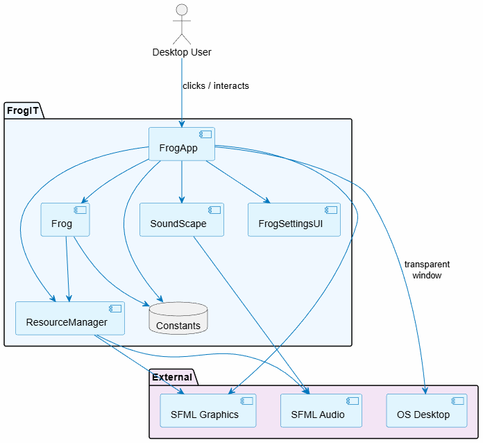
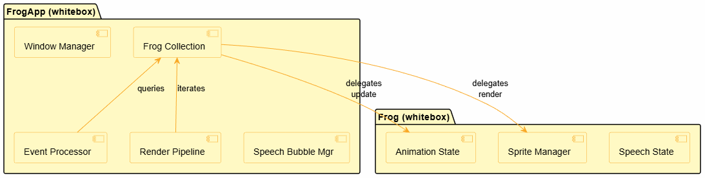
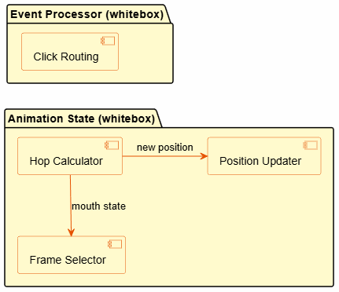
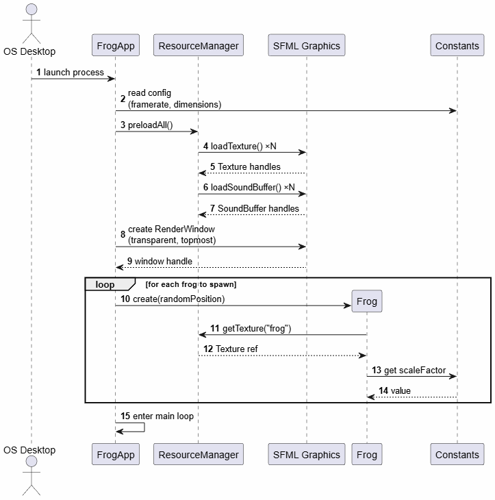
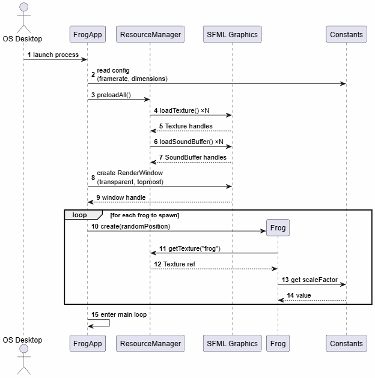
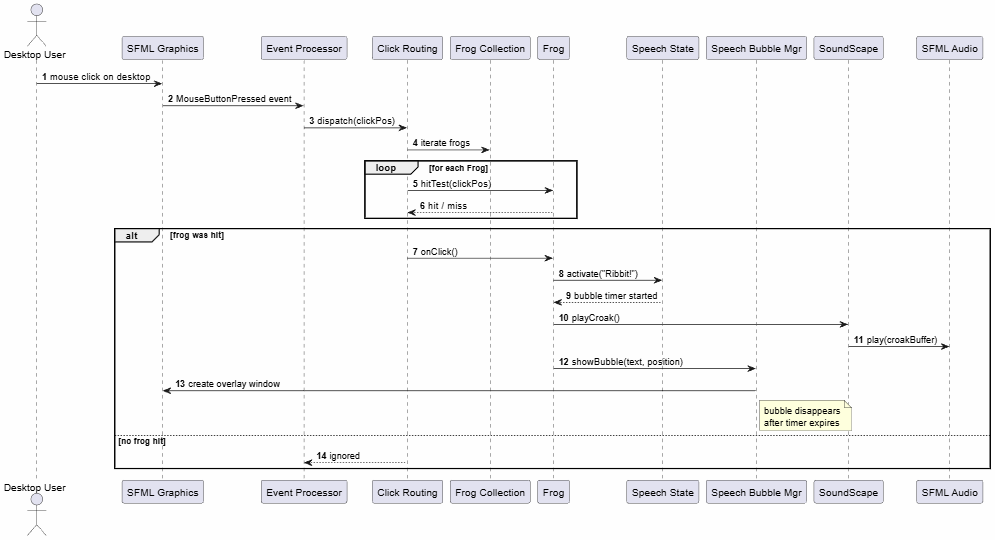
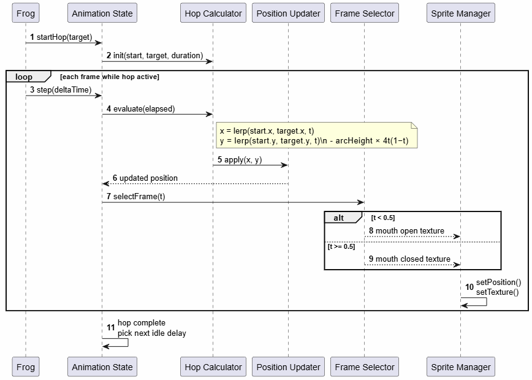
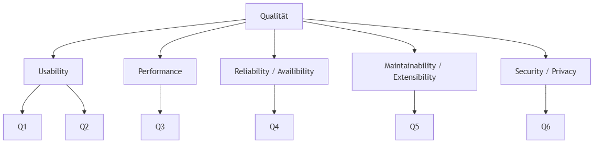

**About arc42**

arc42, the template for documentation of software and system
architecture.

Template Version 9.0-EN. (based upon AsciiDoc version), July 2025

Created, maintained and © by Dr. Peter Hruschka, Dr. Gernot Starke and
contributors. See <https://arc42.org>.

# 1 Introduction and Goals {#section-introduction-and-goals}

## 1.1 Requirements Overview {#_requirements_overview}
FrogIT is a desktop application that allows users to create custom relaxing soundscapes by mixing ambient sounds such as frogs and jungle noises.
Additionally, the system provides visual feedback through animated frogs to enhance the relaxation experience.
**Key features**:
- Create and mix soundscapes
- Adjust sound parameters (e.g. volume)
- Animated frog visualization
- Preset saving and loading

## 1.2 Quality Goals {#_quality_goals}
Based on the quality tree, the most imporant quality goals are:
1. **Performance (High Priority)**
	- Low-latency, real-time audio playback without interruptions
2. **Maintainability / Extensibility (High Priority)**
	- Easy to extend with new sounds, animations and UI components
3. **Usability (Medium Priority)**
	- Intuitive control of the sound mixer
	- Non-intrusive visual feedback during usage
4. **Reliability (Medium Priority)**
	- Robust handling of missing or corrupted resources
5. **Security / Privacy (Low Priority)**
	- Local-only storage of user data without external communication

## 1.3 Stakeholders {#_stakeholders}

| Role/Name              | Contact | Expectations                                                         |
| ---------------------- | ------- | -------------------------------------------------------------------- |
| User                   | -       | Easy-to-use application for relaxation with smooth audio and visuals |
| Developers (Team)      | -       | Maintainable, modular and extensible codebase                        |
| Lecturer / Stakeholder | -       | Clean architecture, proper documentation and working prototype       |

# 2 Architecture Constraints {#section-architecture-constraints}
## 2.1 Technical Constraints
The system is developed under the following technical constraints:
- Implementation language: C++
- Use of SFML for audio processing
- Use of Dear ImGui for the user interface
- Cross-platform support: Windows, macOS, Linux
- Build system: CMake
- CI/CD via GitHub Actions
- Local execution only (no cloud/backend components)

## 2.2 Organizational Constraints
The project is developed under the following organizational conditions:
- Team of four developers
- Agile development using Scrum (weekly Sprints)
- Task Management via GitHub Projects and Kanban board
- Version control with GitHub
- Fixed deadlines defined by the course schedule

## 2.3 Conventions
The following conventions are applied:
- Code follows consistent naming conventions (e.g. camelCase / UpperCamelCase)
- Code formatting is enforced using clang-format
- Documentation is written in Markdown
- UML diagrams are created using PlantUML / draw.io

# 3 Context and Scope {#section-context-and-scope}

## 3.1 Business Context {#_business_context}

| Actor             | Interaction                                              |
| ----------------- | -------------------------------------------------------- |
| User              | Creates and customizes soundscapes, interacts with frogs |
| Local File System | Stores and loads presets and audio resources             |
**Explanation**:
The user interacts directly with FrogIT to create and control soundscapes.
All data (e.g. presets, audio files) is stored locally on the system.
There are no external services or network dependencies.

## 3.2 Technical Context {#_technical_context}

| Component              | Interface                         |
| ---------------------- | --------------------------------- |
| User Interface (ImGui) | User input (mouse, keyboard)      |
| Audio System (SFML)    | Playback of sounds files          |
| File System            | Read/write presets and resources  |
| Operating System       | Window management, input handling |
### Mapping Input / Output to Channels

| Input / Output               | Channel                  |
| ---------------------------- | ------------------------ |
| User input (clicks, sliders) | GUI (Dear ImGUI)         |
| Audio output                 | Speakers via SFML        |
| Visual Output (frogs, UI)    | Screen                   |
| Preset data                  | Local file system (JSON) |

# 4 Solution Strategy {#section-solution-strategy}
The architecture of FrogIT follows a modular and layered approach to ensure maintainability, extensibility and performance

## Key Design Decisions
- **Layered Architecture**
	Separation into UI, application logic and resource handling to keep responsibilities clearly structured.
- **Modular Design**
	Components such as sound management, animation and UI are implemented independently to allow easy extension.
- **Dedicated Audio Handling**
	Audio processing is separated from the UI to ensure smooth, low-latency playback.
- **Observer Pattern**
	Used to connect audio events with frog animations while keeping components loosely coupled.
- **Asynchronous Resource Handling**
	Resources such as audio files are loaded without the application.

## Technology Choices
- C++ as main programming language
- SFML for audio playback and basic rendering
- Dear ImGui for the graphical user interface
- CMake for build configuration
- GitHub Actions for CI/CD

## Quality Focus
The solution strategy is mainly driven by the following quality goals:
- **Performance**: real-time audio without interruptions
- **Maintainability**: clean structure and separation of concerns
- **Usability**: simple and intuitive interaction
- **Reliability**: stable handling of resources and playback

# 5 Building Block View {#section-building-block-view}

## Level 1: Whitebox Overall System

The system as seen from the outside, decomposed into its top-level building blocks. External actors and systems are shown at the boundary.

  

### Black Box Descriptions

| Building Block | Responsibility |
|---|---|
| **FrogApp** | Application orchestrator — window lifecycle, frog collection, event loop, rendering |
| **Frog** | Individual frog entity — animation, sprite state, user interaction |
| **ResourceManager** | Singleton asset cache — preloads and caches textures, images, sounds |
| **SoundScape** | Audio controller — manages sound playback (implementation pending) |
| **FrogSettingsUI** | User configuration UI (placeholder for future) |
| **Constants** | Centralised config values (framerate, dimensions, scaling, etc.) |

### External Systems

| System | Description |
|---|---|
| **Desktop User** | Interacts with frogs via mouse clicks on the desktop overlay |
| **SFML Graphics** | Windowing, sprite, and texture rendering library |
| **SFML Audio** | Sound and sound-buffer playback library |
| **OS Desktop** | Host operating system providing the transparent overlay surface |

## Level 2: Whitebox FrogApp & Frog

Zooms into the two most important Level 1 building blocks.

  

### Black Box Descriptions — FrogApp Internals

| Building Block | Responsibility |
|---|---|
| **Window Manager** | Creates and configures the transparent render window with desktop integration |
| **Frog Collection** | Owns vector of active Frog entities via `unique_ptr` |
| **Event Processor** | Handles OS events (close, mouse click) and routes them to frogs |
| **Render Pipeline** | Updates all frogs each frame, renders sprites to window |
| **Speech Bubble Mgr** | Manages overlay window for frog dialogue display |

### Black Box Descriptions — Frog Internals

| Building Block | Responsibility |
|---|---|
| **Animation State** | Manages hop sequences, timing, and arc calculation |
| **Sprite Manager** | Handles position, scale, and sprite rendering |
| **Speech State** | Controls speech bubble visibility and text content |

## Level 3: Whitebox Animation State & Event Processor

Zooms into the most complex Level 2 blocks.

  

### Black Box Descriptions

| Building Block | Responsibility |
|---|---|
| **Hop Calculator** | Computes parabolic arc position using elapsed time |
| **Position Updater** | Applies delta-time based position updates |
| **Frame Selector** | Switches between open/closed mouth textures during animation |
| **Click Routing** | Performs hit-test on all frogs and dispatches click to matching entity |

Here's the complete Chapter 6. Building block names match Chapter 5 throughout.

# 6 Runtime View {#section-runtime-view}

This section shows how the building blocks from the [Building Block View](#section-building-block-view) collaborate at runtime. Scenarios are chosen for architectural relevance, not completeness.

## 6.1 Application Startup

How FrogIT initialises itself from launch to first rendered frame.

**Notable aspects:**

- **ResourceManager** loads all assets **once** at startup — frogs only hold references, never duplicate textures.
- The render window is created with OS-level transparency flags so the frog sits directly on the desktop.
- Frog instances are heap-allocated via `unique_ptr` and owned by the **Frog Collection** inside FrogApp.

## 6.2 Main Game Loop (Single Frame)

The core loop that runs every frame (~60 fps). This is the heartbeat of the application.

**Notable aspects:**

- The loop follows a strict **Event → Update → Render** order each frame.
- **Delta-time** is used for all movement so animation speed is independent of framerate.
- The Render Pipeline iterates the Frog Collection twice: once for update, once for draw.

## 6.3 User Clicks a Frog

What happens when the desktop user clicks on a frog — from OS event to speech bubble.

**Notable aspects:**

- **Click Routing** performs a hit-test against all frogs in the collection; the **first** matching frog handles the event.
- The **Speech Bubble Mgr** creates a separate small overlay window positioned near the frog — it is not drawn inside the main render window.
- Sound playback is fire-and-forget via **SoundScape**.

## 6.4 Frog Hop Animation

How a single hop is calculated and rendered across multiple frames.

**Notable aspects:**

- The hop arc uses a **parabolic interpolation**: $y = \text{lerp}(y_0, y_1, t) - h \cdot 4t(1-t)$, giving a smooth jump curve.
- **Frame Selector** swaps the mouth texture at the midpoint of the hop — creating the illusion of a croak during the jump.
- After a hop completes, the Animation State picks a random idle delay before scheduling the next hop.

**Exception:** If the calculated landing position is off-screen, the hop target is clamped to the nearest screen edge.

# 7 Deployment View {#section-deployment-view}

## Infrastructure Level 1 {#_infrastructure_level_1}

***\<Overview Diagram\>***

Motivation

:   *\<explanation in text form\>*

Quality and/or Performance Features

:   *\<explanation in text form\>*

Mapping of Building Blocks to Infrastructure

:   *\<description of the mapping\>*

## Infrastructure Level 2 {#_infrastructure_level_2}

### *\<Infrastructure Element 1\>* {#_infrastructure_element_1}

*\<diagram + explanation\>*

### *\<Infrastructure Element 2\>* {#_infrastructure_element_2}

*\<diagram + explanation\>*

...

### *\<Infrastructure Element n\>* {#_infrastructure_element_n}

*\<diagram + explanation\>*

# 8 Cross-cutting Concepts {#section-concepts}

## *\<Concept 1\>* {#_concept_1}

*\<explanation\>*

## *\<Concept 2\>* {#_concept_2}

*\<explanation\>*

...

## *\<Concept n\>* {#_concept_n}

*\<explanation\>*

# 9 Architecture Decisions {#section-design-decisions}

This section documents the key architectural decisions made during the development of FrogIT.
Each decision is captured as an Architecture Decision Record (ADR), following a lightweight format
that includes context, considered options, the chosen solution, and its consequences.

| ADR   | Title                                              | Status   |
|-------|----------------------------------------------------|----------|
| [ADR-0001](#adr-0001) | Use a Dedicated Audio Thread for Low-Latency Playback | Accepted |
| [ADR-0002](#adr-0002) | Use SFML for Audio and Dear ImGui for the UI          | Accepted |
| [ADR-0003](#adr-0003) | Use JSON as the Format for Saving Presets             | Accepted |

---

## ADR-0001 — Use a Dedicated Audio Thread for Low-Latency Playback {#adr-0001}

**Status:** Accepted

**Context:**
FrogIT must play ambient sounds in real time while the user interface remains responsive.
Running audio and UI on the same thread causes audio stutters and UI lag under load.

**Decision:**
Use **multi-threading with a dedicated audio thread** to isolate audio processing from the UI event loop.
This integrates cleanly with SFML and is the most reliable way to guarantee real-time audio playback.

**Alternatives considered:**
- Single-threaded model (UI + audio together)
- External audio backend with real-time prioritization
- Event-based audio processing without its own thread

Consequences

| Type     | Description                                                      |
|----------|------------------------------------------------------------------|
| ✅ Positive | Stable, low-latency audio playback even under UI load          |
| ✅ Positive | UI remains fully responsive                                    |
| ⚠️ Negative | Higher complexity due to thread synchronization requirements  |
| ⚠️ Negative | Requires more thorough testing for race conditions            |

---

## ADR-0002 — Use SFML for Audio and Dear ImGui for the UI {#adr-0002}

**Status:** Accepted

**Context:**
FrogIT requires audio playback, windowed rendering, and a user interface. The chosen tools must be
lightweight, C++-friendly, and quick to integrate within the team's time constraints.

**Decision:**
Use **SFML** for audio and rendering and **Dear ImGui** for the graphical user interface.
This combination minimises boilerplate, is beginner-friendly, and fits the project scope.

**Alternatives considered:**
- SDL2 + ImGui
- Qt (full framework)
- Custom UI + custom audio backend

Consequences

| Type     | Description                                                              |
|----------|--------------------------------------------------------------------------|
| ✅ Positive | Fast prototyping with minimal setup complexity                        |
| ✅ Positive | SFML is easy to learn and well-documented for C++ beginners           |
| ⚠️ Negative | SFML does not guarantee the lowest possible audio latency             |
| ⚠️ Negative | Dear ImGui uses an immediate-mode model, not a native desktop UI paradigm |

---

## ADR-0003 — Use JSON as the Format for Saving Presets {#adr-0003}

**Status:** Accepted

**Context:**
Users can save and load sound profiles (presets). The storage format must be structured,
human-editable, and stable across application versions. Local-only storage is required per
the privacy constraints (see Section 2.1).

**Decision:**
Use **JSON** for serialising and deserialising soundscape presets, using the `nlohmann/json` library.
JSON is simple, widely supported, and ideal for configuration/preset data.

**Alternatives considered:**
- XML
- Binary format
- YAML
- TOML

Consequences

| Type     | Description                                                        |
|----------|--------------------------------------------------------------------|
| ✅ Positive | Human-readable files allow easy manual debugging and editing    |
| ✅ Positive | Many stable, well-maintained C++ JSON parsers are available     |
| ⚠️ Negative | JSON files are larger and slightly slower to parse than binary formats |
| ⚠️ Negative | JSON has weaker typing compared to XML or TOML                 |

# 10 Quality Requirements {#section-quality-scenarios}

## Quality Requirements Overview {#_quality_requirements_overview}

The quality requirements for FrogIT are derived from the quality tree established during the
architecture definition phase. They refine and operationalise the top-level quality goals stated
in [Section 1.2](#_quality_goals) into concrete, measurable scenarios.

The tree is structured around five top-level quality dimensions:

| Quality Dimension          | Priority | Quality IDs  |
|----------------------------|----------|--------------|
| Performance                | 🔴 High  | Q3           |
| Maintainability / Extensibility | 🔴 High | Q5          |
| Usability                  | 🟡 Medium | Q1, Q2      |
| Reliability / Availability | 🟡 Medium | Q4          |
| Security / Privacy         | 🟢 Low   | Q6           |

### Quality Attributes

| ID | Quality Dimension | Description |
|----|-------------------|-------------|
| Q1 | Usability | Intuitive control of mixer and presets |
| Q2 | Usability | Non-intrusive frog animations while the user works |
| Q3 | Performance | Low-latency, continuous audio playback (real-time mixing) |
| Q4 | Reliability / Availability | Robust playback with graceful recovery from missing or corrupt resources |
| Q5 | Maintainability / Extensibility | Easy to add new sound types, animation behaviours, or UI components |
| Q6 | Security / Privacy | Local-only storage of user presets with no telemetry by default |

---

## Quality Scenarios {#_quality_scenarios}

Quality scenarios make quality requirements concrete and testable. Each scenario follows the
arc42 stimulus–response structure. Scenarios marked **ASR** are architecture-significant and
directly influenced architectural decisions.

---

### Scenario A — Low-Latency Audio Playback 🔴 ASR {#scenario-a}

> *Relates to: Q3 — Performance*

| Field | Description |
|---|---|
| **Source** | End user (interactive control) |
| **Trigger** | User presses Play or adjusts a volume slider while playback is active |
| **Artifact** | Sound engine / mixer |
| **Environment** | Desktop (Windows; background CPU load typical for office work) |
| **Response** | Playback responds to user action without audible glitch; adopted changes (volume, pan) are applied within the next audio buffer cycle |
| **Response Measure** | End-to-end reaction time $\leq 50\,\text{ms}$ from UI action to audible effect; no buffer underruns during normal operation |

Architectural relevance

This scenario is the primary driver behind **ADR-0001** (dedicated audio thread) and **ADR-0002**
(SFML). Separating audio from the UI thread ensures that UI load does not cause buffer underruns
or audible glitches.

---

### Scenario B — Resource Failure Handling 🟡 {#scenario-b}

> *Relates to: Q4 — Reliability / Availability*

| Field | Description |
|---|---|
| **Source** | File system / storage |
| **Trigger** | A sound resource file is missing or corrupted at playback time |
| **Artifact** | Sound playback subsystem |
| **Environment** | User starts a saved preset referencing a missing file |
| **Response** | Playback continues for other sounds; missing sound is skipped and a non-blocking error message is shown with a remediation option (choose replacement) |
| **Response Measure** | Playback continues with $\leq 1\,\text{s}$ interruption; user receives an error dialog; application does not crash |

Architectural relevance

This scenario motivates defensive loading in the **ResourceManager** (fail-safe singleton asset
cache) and structured error propagation from the **SoundScape** layer up to the UI. It also
influenced the choice of JSON presets (**ADR-0003**), which allow partial loading of valid entries
when individual references are missing.

---

### Scenario C — Non-Intrusive Overlay 🟡 {#scenario-c}

> *Relates to: Q1, Q2 — Usability*

| Field | Description |
|---|---|
| **Source** | End user |
| **Trigger** | User has FrogIT running while switching to other applications |
| **Artifact** | Animated frog overlay |
| **Environment** | User working with other desktop applications (multiple windows open) |
| **Response** | Frogs animate in a non-obstructive overlay mode; user can toggle or minimise the overlay quickly via tray or menu |
| **Response Measure** | Overlay does not steal focus from other windows; toggle response $\leq 200\,\text{ms}$ |

Architectural relevance

This scenario shapes the OS-level transparent window configuration managed by the **Window Manager**
building block and the **Speech Bubble Mgr**, which deliberately uses a *separate* small overlay
window rather than an in-canvas element to avoid interfering with other application windows.

---

### Scenario D — Adding a New Sound or Animation 🔴 ASR {#scenario-d}

> *Relates to: Q5 — Maintainability / Extensibility*

| Field | Description |
|---|---|
| **Source** | Developer / team |
| **Trigger** | Developer adds a new sound type or animation effect |
| **Artifact** | Codebase / modules (`SoundLayer`, `Animation`) |
| **Environment** | Local development machine; existing CI pipeline active |
| **Response** | New sound, animation, or texture can be introduced by placing a file in the appropriate asset folder, with minimal or no changes to core logic |
| **Response Measure** | Adding a single resource is a single-file operation with no changes to existing business logic required |

Architectural relevance

This is the primary driver of the **modular design** and **layered architecture** described in
Section 4. The **ResourceManager** singleton and asset-folder convention directly support this
scenario by decoupling resource discovery from application logic.

---

### Scenario E — Local-Only Preset Persistence 🟢 {#scenario-e}

> *Relates to: Q6 — Security / Privacy*

| Field | Description |
|---|---|
| **Source** | User |
| **Trigger** | User saves a preset |
| **Artifact** | Preset persistence layer |
| **Environment** | Local machine (all platforms) |
| **Response** | Preset is saved only to the local file system; no automatic network transmission occurs; any explicit export action prompts the user first |
| **Response Measure** | No network activity occurs during save; verifiable by inspecting the locally written JSON file |

Architectural relevance

This scenario reinforces the local-only architecture constraint from Section 2.1 and the choice
of JSON as the preset format (**ADR-0003**), which produces a transparent, inspectable file with
no hidden metadata or remote references.

---

## Mapping: Architecture-Significant Requirements (ASRs)

The following table summarises which scenarios are considered architecture-significant and
their relative priority:

| Priority | Scenario | Quality Dimension | Key Architectural Response |
|----------|----------|-------------------|---------------------------|
| 🔴 High  | [Scenario A](#scenario-a) — Low-latency audio | Performance | Dedicated audio thread (ADR-0001), SFML (ADR-0002) |
| 🔴 High  | [Scenario D](#scenario-d) — Extensibility | Maintainability | Modular design, asset-folder convention, ResourceManager |
| 🟡 Medium | [Scenario B](#scenario-b) — Resource failure | Reliability | Defensive ResourceManager, fail-safe SoundScape loading |
| 🟡 Medium | [Scenario C](#scenario-c) — Non-intrusive overlay | Usability | Separate overlay windows, no focus stealing |
| 🟢 Low   | [Scenario E](#scenario-e) — Local persistence | Security / Privacy | Local JSON files only, no network layer (ADR-0003) |

# 11 Risks and Technical Debts {#section-technical-risks}

# 12 Glossary {#section-glossary}

| Term | Definition |
|---|---|
| *\<Term-1\>* | *\<definition-1\>* |
| *\<Term-2\>* | *\<definition-2\>* |
