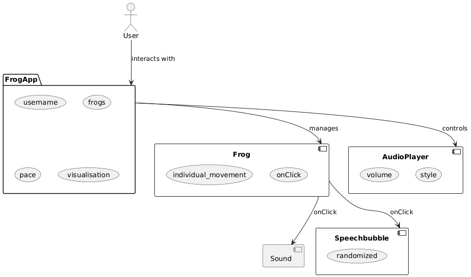

# FrogIT

## Software Requirements Specification (SRS)

### 1. Introduction

#### 1.1 Overview

**FrogIT** is a relaxation-focused desktop application that allows users to create and customize ambient soundscapes for sleeping, studying, or unwinding.  
What makes FrogIT unique is its combination of **customizable audio environments** and **visual feedback** in the form of **animated frogs** that jump and move.  
This multi-sensory design helps users achieve a more immersive and enjoyable relaxation experience.

#### 1.2 Scope

This document describes the **functional and non-functional software requirements** for the FrogIT desktop application.  
It covers:

- System behavior, functionality, and user interaction.
- Technical constraints and dependencies.
- Both functional and non-functional requirements.

It does **not** include:

- Hardware requirements.
- Future mobile or web versions (possible later expansions).

#### 1.3 Definitions, Acronyms, and Abbreviations

|Term|Definition|
|---|---|
|GUI|Graphical User Interface|
|SFML|Simple and Fast Multimedia Library (C++ framework for audio and graphics)|
|ImGui|Immediate Mode Graphical User Interface (C++ GUI library)|
|SRS|Software Requirements Specification|
|RUP|Rational Unified Process|

#### 1.4 References

- [SFML Documentation](https://www.sfml-dev.org/documentation/3.0.2)
- [Dear ImGui GitHub Repository](https://github.com/ocornut/imgui)
- Internal project documentation in [**YouTrack**](https://youtrack.fsn1.mo-ri.tz/dashboard) and https://github.com/RyhoBtw/FrogIT/tree/main/docs
- Team Blog: [**Team Blog**](https://github.com/RyhoBtw/FrogIT/discussions)

### 2. Functional Requirements

#### 2.1 Overview

FrogIT provides an interactive environment where users can:

- Mix and play multiple audio layers (rain, wind, frogs, fire crackling, etc.)
- Adjust sound parameters such as volume and frequency
- Visualize animated frogs that jump and move across the desktop

  
*Current use cases of FrogIT*

#### 2.2 Feature 1 – Create Custom Soundscape

**User Stories:**

- As a user, I want to combine different ambient sounds (rain, forest, frogs, etc.) so I can create a relaxing atmosphere.
- As a user, I want to adjust each sound’s volume and intensity individually.

**UI Mockup (concept):**  

A simple interface with sliders for each sound.

**UML Behavior (Activity Flow):**
...

**Estimated Effort:** Medium

#### 2.3 Feature 2 – Animated Frog Visualization

**User Stories:**

- As a user, I want to see animated frogs jumping while the sound is playing so that I can enjoy a more engaging relaxation experience.
- As a user, i want to still be able to use my desktop for work tasks, while the frogs are animated, so i can stay producitve.

**UI Mockup (concept):**  

A visual overlay showing animated frogs jumping around the desktop.

**UML Behavior (Sequence):**
...

**Estimated Effort:** High

### 3. Non-Functional Requirements

| Category            | Requirement                                                                  |
| ------------------- | ---------------------------------------------------------------------------- |
| **Usability**       | The interface must be intuitive, with clear controls and responsive sliders. |
| **Reliability**     | The application should handle missing or corrupted audio files gracefully.   |
| **Performance**     | Real-time audio playback without noticeable lag or stutter.                  |
| **Efficiency**      | Low CPU and memory usage to support background operation while relaxing.     |
| **Maintainability** | The codebase should follow best practices for C++                            |
| **Flexibility**     | Easy to extend with new sounds or visual effects.                            |
| **Testability**     | Each feature can be tested independently.                                    |
| **Security**        | Local storage only, no external data transmission.                           |

### 4. Technical Constraints

- **Programming Language:** C++
- **Frameworks:** SFML for audio and graphics, Dear ImGui for GUI
- **Building-Framework:** cmake with any compiler
- **Testing:** Catch2
- **Static Analysis:** cppcheck
- **Platform:** Desktop (cross-platform via cmake)
- **Version Control:** GitHub
- **Project Management:** YouTrack (Scrum-based)
- **Sprint Duration:** 1 week
- **License Compliance:** Use of open-source libraries under permissive licenses (e.g., zlib/libpng for SFML, MIT for Dear ImGui)